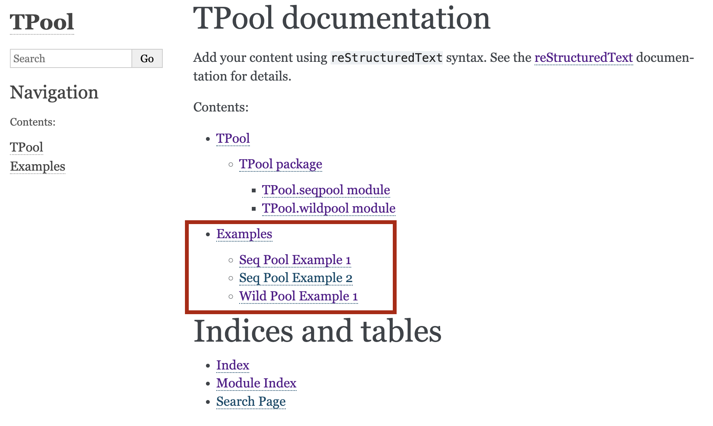

# Sphinx Example Includer


[](https://badge.fury.io/py/sphinx-example-includer)

Automatically Generate .rst files from examples folder for the sphinx documentation



## Installation
```
pip install sphinx_example_includer
```

## Usage
```
usage: Sphinx Example Includer [-h] [--debug] [--overwrite] --files FILES [FILES ...] [--dest_dir DEST_DIR] [--toc-fname TOC_FNAME]

A tool to include example code or any other files into sphinx documentation automatically

options:
  -h, --help            show this help message and exit
  --debug               Showing debug messages
  --overwrite           Overwrite files that already exists
  --files FILES [FILES ...]
                        one or more files to be
  --dest_dir DEST_DIR   The output directory
  --toc-fname TOC_FNAME
                        The name of the toc file
```

## Example
```
python -m sphinx_example_includer  --files examples/*example*py --overwrite --dest docs/source/examples 
```

## How to use it
1. Generate the docs using [Sphinx](https://www.sphinx-doc.org/en/master/usage/quickstart.html). 
2. Install the library into your project.
3. Run the package as follows `python -m sphinx_example_includer` (don't forget to pass the arguments).
4. add the toc file to the `indext.rst` (or any other place of your choice).
5. regenerate the docs (e.g., `make html`).